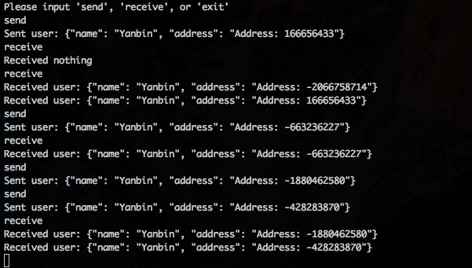

# Kafka Avro Demo

#### Start Apache kafka service

Reference Kafka offical [Quickstart](http://kafka.apache.org/quickstart), just start ZooKeeper and Kafka services

```
$ bin/zookeeper-server-start.sh config/zookeeper.properties
$ bin/kafka-server-start.sh config/server.properties
```

That's it. Don't have to create topic, this demo program will create the topic `user-info-topic` automatically.

#### Start Demo Application

Since this is a Maven project, so we can use Maven command

```
mvn exec:java -Dexec.mainClass=cc.unmi.KafkaDemo
```

to start the Demo application. It's a simple interactive interface

1. `send`: Send message
1. `receive`: Consume message
1. `exit`: Quit this application

Here is the screenshot

!